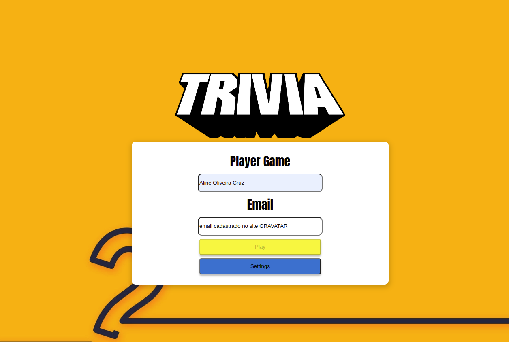
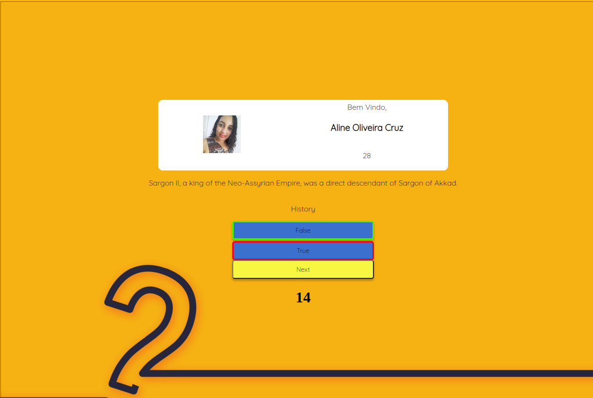
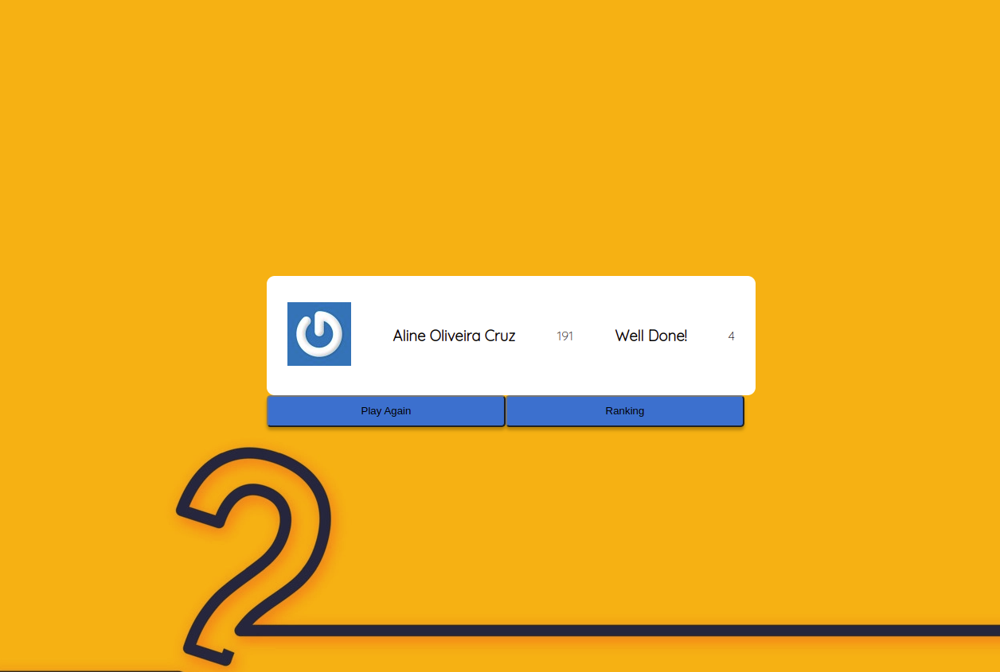

# Boas-vindas ao repositório do projeto de Trivia!

Aqui você vai encontrar os detalhes de como foi estruturado o desenvolvimento deste projeto a partir deste repositório.

# Entregáveis

  
<strong>👨‍💻 O que foi desenvolvido</strong>
 

  
   
  
    
  

Um jogo de perguntas e respostas baseado no jogo **Trivia** _(tipo um show do milhão americano rs)_ utilizando _React e Redux_, desenvolvendo em grupo suas funcionalidades de acordo com as demandas definidas em um quadro _Kanban_. Temos uma aplicação onde a pessoa usuária pode:

  - Logar no jogo e, se o email tiver cadastro no site [Gravatar](https://pt.gravatar.com/), ter sua foto associada ao perfil da pessoa usuária.
  - Acessar a página referente ao jogo, onde se deverá escolher uma das respostas disponíveis para cada uma das perguntas apresentadas. A resposta deve ser marcada antes do contador de tempo chegar a zero, caso contrário a resposta deverá ser considerada errada.
  - Ser redirecionada, após 5 perguntas respondidas, para a tela de score, onde o texto mostrado depende do número de acertos.
  - Visualizar a página de ranking, se quiser, ao final de cada jogo.
  - Configurar algumas opções para o jogo em uma tela de configuração acessível a partir do cabeçalho do app.

  
<strong>:memo: Habilidades</strong>
 

Nesse projeto, nos tornamos capazes de:

  - Criar um store Redux em aplicações React

  - Criar reducers no Redux em aplicações React

  - Criar actions no Redux em aplicações React

  - Criar dispatchers no Redux em aplicações React

  - Conectar Redux aos componentes React

  - Criar actions assíncronas na sua aplicação React que faz uso de Redux.

  - Escrever testes para garantir que sua aplicação possua uma boa cobertura de testes.

 

# Requisitos

Nesse projeto, a pessoa que joga deve conseguir completar o jogo e conseguir ver seu placar depois de responder todas as 5 perguntas, além de acessar a tela de configurações e de ranking.

Os requisitos exigidos foram estes abaixo:

## 1. Crie a tela de login, onde a pessoa que joga deve preencher as informações para iniciar um jogo

---

## 2. Crie o botão de iniciar o jogo

---

## 3. Crie um botão que leva a pessoa para tela de configuração

---

## 4. Desenvolva testes para atingir 90% de cobertura da tela de Login

---

## 5. Crie um _header_ que deve conter as informações da pessoa jogadora

---

## 6. Crie a página de jogo que deve conter as informações relacionadas à pergunta

---

## 7. Desenvolva o estilo que, ao clicar em uma resposta, a correta deve ficar verde e as incorretas, vermelhas

---

## 8. Desenvolva um timer onde a pessoa que joga tem 30 segundos para responder

---

## 9. Crie o placar com as seguintes características:

---

## 10. Crie um botão de `Next` que apareça após a resposta ser dada

---

## 11. Desenvolva o jogo de forma que a pessoa jogadora deve responder 5 perguntas no total

---

## 12. Desenvolva o header de _feedback_ que deve conter as informações da pessoa jogadora

---

## 13. Crie a mensagem de _feedback_ para ser exibida a pessoa usuária

---

## 14. Exiba as informações relacionadas aos resultados obtidos para a pessoa usuária

---

## 15. Crie a opção para a pessoa jogadora poder jogar novamente

---

## 16. Crie a opção para a pessoa jogadora poder visualizar a tela de _ranking_

---

## 17. Desenvolva testes para atingir 90% de cobertura da tela de Feedbacks

---

## 18. Crie um botão para ir ao início

---

## 19. Crie o conteúdo da tela de _ranking_

---

## 20. Desenvolva testes para atingir 90% de cobertura da tela de Ranking

---

## 21. Desenvolva testes para atingir 90% de cobertura da tela de Jogo

---
## 22. Desenvolva testes para atingir 95% de cobertura total

---

### 23. Ao mudar o valor do dropdown categoria, apenas perguntas da categoria selecionada devem aparecer para a pessoa que está jogando. Essa configuração será identificada pela chave category no retorno da API;

---

### 24. Ao mudar o valor do dropdown dificuldade, apenas perguntas da dificuldade selecionada devem aparecer para a pessoa que está jogando. Essa configuração será identificada pela chave difficulty no retorno da API;

---

### 25. Ao mudar o valor do dropdown tipo, apenas perguntas do tipo selecionado devem aparecer para a pessoa que está jogando. Essa configuração será identificada pela chave type no retorno da API.

 

## Obs: Projeto em andamento....